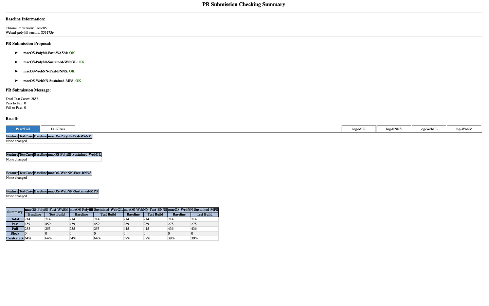

# RegressionChecker
In order to improve the quality of Web ML master branch and avoid new problems such as crash, freeze, etc.caused by the new code.

## Install
* Installed target testing chromium package.
* Installed dependency node modules:
   ```sh
   $ npm install
   ```

   if `npm install chromedriver` is fail, you can install `chromedriver` with this command:

      $ npm install chromedriver --chromedriver_cdnurl=http://cdn.npm.taobao.org/dist/chromedriver

* Set config.json file
   + `platform`: The test platform, such as `Android`, `Linux`, `Mac` and `Windows`.
   + `chromiumPath`: Path of chromium browser.

**Note**: If the platform is set as `Android`, the chromiumPath will not be set.

## Start

```sh
$ npm start
```

## Support platform

|  Platform  | Ubuntu 16.04 |    Mac    |  Android  |  Windows  |
|    :---:   |     :---:    |   :---:   |   :---:   |   :---:   |
|  chromium  |     pass     |    pass   |    pass   |    todo   |

## Result html


